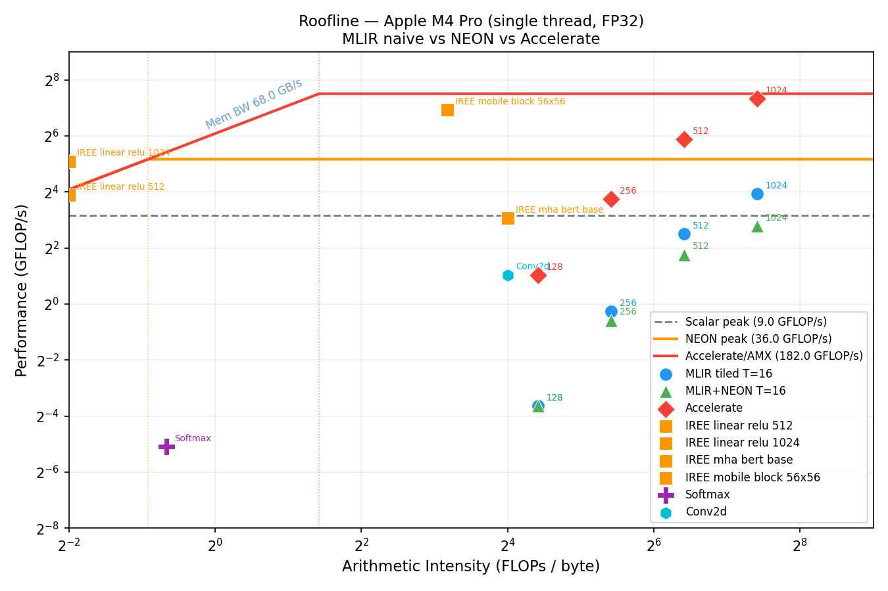

# MLIR Empirical Study (AArch64 CPU - Apple M4 Pro)

Empirical study of MLIR optimization passes on AArch64 CPU (Apple M4 Pro).  

## Roofline



> Regenerate with `make roofline`. Full PDF in [`results/roofline.pdf`](results/roofline.pdf).

---

## Research Questions

| ID | Question | Key Finding |
|----|----------|-------------|
| **RQ1** | How does tile size sensitivity vary across operation types and problem sizes? | T=16 beats T=64 by 3–4× — llvm-mca confirms same IPC; speedup is entirely from cache effects, not code quality |
| **RQ2** | Do different MLIR lowering paths (Affine vs SCF vs Tiled) produce measurably different performance? | Affine ≡ SCF (< 3% difference); tiling gives +20–25% at N ≥ 512 |
| **RQ3** | What is the impact of `--affine-loop-fusion` on a matmul+relu+bias chain? | No measurable effect (Δ < 1σ): matmul O(N³) dominates, elementwise O(N²) is < 0.2% of time |
| **RQ4** | Do the same tiling patterns hold across conv2d, batch_matmul, softmax? | Yes for compute-bound kernels; softmax is memory-bound (AI < ridge point) |
| **RQ5** | How large is the gap between MLIR naive passes and Apple Accelerate (BLAS/AMX)? | 10–60× gap, growing with N; vectorization closes only 15%; AMX inaccessible from MLIR |

**Three-tier result (matmul 1024²):**

| System | GFLOP/s |
|--------|---------|
| MLIR naive (best path) | ~15 |
| IREE production MLIR | ~37 |
| Apple Accelerate (AMX) | ~169 |

## Hardware

Apple M4 Pro — recorded in `results/environment.txt`.

| Parameter | Value |
|-----------|-------|
| CPU | Apple M4 Pro, 12 cores |
| L1 D-cache | 64 KB |
| L2 cache | 4 MB |
| RAM | 24 GB |
| Peak scalar FP32 | 9 GFLOP/s (single thread) |
| Peak NEON FP32 | 36 GFLOP/s (single thread) |
| Peak AMX FP32 | ~182 GFLOP/s (measured via Accelerate) |
| Memory bandwidth | 68 GB/s |

---

## Quickstart

```bash
# 1. Clone and setup (once)
git clone <repo> && cd mlir-study
bash setup.sh          # creates .venv/, builds baselines, exports PyTorch models

# 2. Smoke test
make verify            # 4x4 matmul via two pipelines — should print [PASS]

# 3. Full study
make all               # collect-env → verify → baselines → models → rq1–rq5 → rq-iree → roofline
```

**Reproduce a single experiment:**
```bash
make rq5               # MLIR vs Accelerate baseline
make rq-iree           # IREE production benchmark
make roofline          # regenerate roofline plot from existing CSVs
```

---

## Directory Structure

```
mlir-study/
├── setup.sh                  # One-shot setup (venv + baselines + model export)
├── Makefile                  # Orchestrator — see targets below
├── environment.sh            # Pin tool paths; source at top of every script
├── venv/
│   └── requirements.txt      # torch==2.12.0, iree-turbine, numpy, matplotlib
│
├── kernels/                  # MLIR source files
│   ├── matmul/
│   │   ├── smoke_test.mlir   # 4×4 correctness check
│   │   └── bench.mlir.tpl    # NxN template — sed 's/SIZE/512/g'
│   ├── conv2d/
│   │   ├── conv2d.mlir       # 1×58×58×64 → 1×56×56×64 (ResNet-like)
│   │   └── bench.mlir.tpl    # Parametric: OSIZE before SIZE in sed
│   ├── batch_matmul/
│   │   └── bench.mlir.tpl    # BATCH×SIZE×SIZE — attention-scale
│   ├── elementwise/
│   │   └── chain.mlir        # matmul + relu + bias (RQ3)
│   ├── reduction/
│   │   └── softmax.mlir      # Row-wise softmax 512×512 (memory-bound)
│   └── models/               # Generated by scripts/export_models.py
│       ├── linear_relu_512.mlir
│       ├── linear_relu_1024.mlir
│       ├── conv_bn_relu_56x56.mlir
│       ├── mha_bert_base.mlir
│       └── mobile_block_56x56.mlir
│
├── pipelines/                # Lowering pass pipelines (mlir-opt → LLVM dialect)
│   ├── to_affine.sh          # Path A: Linalg → Affine → LLVM
│   ├── to_scf.sh             # Path B: Linalg → SCF → LLVM
│   ├── to_affine_tiled.sh    # Path C: Path A + --affine-loop-tile T,T,T
│   ├── to_affine_fused.sh    # Path D: Path A + --affine-loop-fusion (RQ3)
│   ├── to_vector.sh          # Path E: Path C + --affine-super-vectorize (NEON)
│   └── to_native.sh          # AoT: mlir-translate → clang → native binary
│
├── scripts/
│   ├── verify.sh             # Smoke test (paths A + B, checks output = 4.0)
│   ├── collect_env.sh        # Dumps hw + tool versions → results/environment.txt
│   ├── _run_mlir.sh          # Internal: runs pre-lowered MLIR via mlir-runner
│   │                         #   (hyperfine wrapper — avoids comma in --shared-libs)
│   ├── export_models.py      # Exports 5 PyTorch layers → kernels/models/ via iree-turbine
│   ├── rq1_sweep_tiles.sh    # RQ1: sweep N×T → results/rq1_tiling.csv
│   ├── rq2_compare_paths.sh  # RQ2: affine/scf/tiled → results/rq2_paths.csv
│   ├── rq3_fusion.sh         # RQ3: unfused vs fused → results/rq3_fusion.csv
│   ├── rq4_workloads.sh      # RQ4: conv2d/batch_matmul/softmax → results/rq4_workloads.csv
│   ├── rq5_vs_baseline.sh    # RQ5: MLIR vs Accelerate → results/rq5_vs_baseline.csv
│   ├── rq_iree.sh            # IREE wall-clock benchmark (incl. module load) → results/rq_iree.csv
│   ├── bench_iree_runtime.py # IREE per-call timing, no load overhead → results/rq_iree_clean.csv
│   ├── llvm_mca_analysis.sh  # Static IPC/throughput via llvm-mca → results/llvm_mca.csv
│   ├── roofline.sh           # Text roofline table → results/roofline.csv
│   └── plot_roofline.py      # Roofline PDF/PNG → results/roofline.{pdf,png}
│
├── baselines/
│   ├── blas_matmul.c         # cblas_sgemm (Apple Accelerate) for N=128/256/512/1024
│   ├── blas_conv.c           # im2col + cblas_sgemm (Accelerate) for conv2d
│   └── Makefile              # make all → builds blas_matmul_{128,256,512,1024} + blas_conv
│
└── results/                  # All output — committed for reproducibility
    ├── environment.txt       # HW + tool versions snapshot
    ├── rq1_tiling.csv        # size_N, tile_T, time_mean_s, time_stddev_s
    ├── rq2_paths.csv         # size_N, path, tile_T, time_mean_s, time_stddev_s
    ├── rq3_fusion.csv        # variant, time_mean_s, time_stddev_s
    ├── rq4_workloads.csv     # kernel, variant, time_mean_s, time_stddev_s
    ├── rq5_vs_baseline.csv   # size_N, variant, time_mean_s, time_stddev_s, gflops
    ├── rq_iree.csv           # IREE wall-clock (incl. load overhead) per model
    ├── rq_iree_clean.csv     # IREE per-call (no load overhead) — generated by bench_iree_runtime.py
    ├── llvm_mca.csv          # variant, N, instructions, cycles, ipc, uops_per_cycle
    ├── llvm_mca_*.txt        # Full llvm-mca reports per variant
    ├── roofline.csv          # kernel, AI, measured_gflops, roofline_bound, efficiency_pct
    ├── roofline.pdf          # Central paper figure (vector + log-log axes)
    └── roofline.png          # Quick-preview PNG
```

---

## Pipelines

Each pipeline script takes a `.mlir` file as input and emits lowered MLIR (LLVM dialect) on stdout.

```bash
bash pipelines/to_affine.sh kernels/matmul/smoke_test.mlir > lowered.mlir
```

| Script | MLIR passes applied | Use in study |
|--------|--------------------|-|
| `to_affine.sh` | `convert-linalg-to-affine-loops` → `lower-affine` → LLVM | RQ2 Path A |
| `to_scf.sh` | `convert-linalg-to-loops` → LLVM | RQ2 Path B |
| `to_affine_tiled.sh <input> <T>` | + `affine-loop-tile=tile-sizes=T,T,T` | RQ1, RQ2 Path C |
| `to_affine_fused.sh` | + `affine-loop-fusion` | RQ3 fused variant |
| `to_vector.sh <input> <T>` | + `affine-super-vectorize=virtual-vector-size=4` | RQ5 NEON path |
| `to_native.sh <input> <binary>` | Full AoT: `mlir-translate --mlir-to-llvmir` → `clang -O0` | Standalone benchmarks |

All pipelines end with the same LLVM lowering suffix:
```
--convert-scf-to-cf --convert-cf-to-llvm --convert-ub-to-llvm
--convert-vector-to-llvm --convert-arith-to-llvm --convert-math-to-llvm
--convert-func-to-llvm --finalize-memref-to-llvm
--convert-index-to-llvm --reconcile-unrealized-casts
```

---

## Scripts — What Each One Produces

### Setup

| Script | Command | Output |
|--------|---------|--------|
| `setup.sh` | `bash setup.sh` | Creates `.venv/`, builds baselines, exports models |
| `collect_env.sh` | `make collect-env` | `results/environment.txt` |
| `verify.sh` | `make verify` | PASS/FAIL to stdout |
| `export_models.py` | `make models` | `kernels/models/*.mlir` (5 PyTorch layers) |

### Experiments

| Script | Command | Output CSV | Columns |
|--------|---------|-----------|---------|
| `rq1_sweep_tiles.sh` | `make rq1` | `rq1_tiling.csv` | size_N, tile_T, time_mean_s, time_stddev_s |
| `rq2_compare_paths.sh` | `make rq2` | `rq2_paths.csv` | size_N, path, tile_T, time_mean_s, time_stddev_s |
| `rq3_fusion.sh` | `make rq3` | `rq3_fusion.csv` | variant, time_mean_s, time_stddev_s |
| `rq4_workloads.sh` | `make rq4` | `rq4_workloads.csv` | kernel, variant, time_mean_s, time_stddev_s |
| `rq5_vs_baseline.sh` | `make rq5` | `rq5_vs_baseline.csv` | size_N, variant, time_mean_s, time_stddev_s, gflops |
| `rq_iree.sh` + `bench_iree_runtime.py` | `make rq-iree` | `rq_iree.csv` + `rq_iree_clean.csv` | wall-clock (incl. load) + per-call (no load) |

### Analysis

| Script | Command | Output | Notes |
|--------|---------|--------|-------|
| `bench_iree_runtime.py` | `.venv/bin/python3 scripts/bench_iree_runtime.py` | `rq_iree_clean.csv` | Per-call timing without 700× module-load overhead. Requires vmfb files in `/tmp/mlir_iree/` — run `make rq-iree` first |
| `llvm_mca_analysis.sh` | `make llvm-mca` | `llvm_mca.csv` + `llvm_mca_*.txt` | Static IPC via llvm-mca (LLVM 23 from source build). Uses Homebrew llc + source-built llvm-mca |
| `roofline.sh` | `make roofline` | `roofline.csv` | Text table: AI, GFLOP/s, efficiency % |
| `plot_roofline.py` | `make roofline` | `roofline.{pdf,png}` | Reads `rq5_vs_baseline.csv`, `rq4_workloads.csv`, `rq_iree_clean.csv`. **Requires `rq_iree_clean.csv` to show IREE points** |

### Known Limitation — IREE vmfb files

`bench_iree_runtime.py` reads compiled model binaries from `/tmp/mlir_iree/*.vmfb`.  
These live in `/tmp/` and are **not persisted** across reboots.  
`make rq-iree` always recompiles them and immediately calls `bench_iree_runtime.py`, so running:

```bash
make rq-iree && make roofline
```

always produces a complete roofline with IREE points.

---

## Makefile Targets

| Target | What it runs |
|--------|-------------|
| `make all` | Full pipeline: collect-env → verify → baselines → models → rq1–rq5 → rq-iree → roofline |
| `make verify` | Smoke test only (< 5s) |
| `make collect-env` | Hardware + tool version snapshot |
| `make baselines` | Build Accelerate BLAS reference binaries |
| `make models` | Export PyTorch models to MLIR via iree-turbine |
| `make rq1` … `make rq5` | Individual RQ experiments |
| `make rq-iree` | IREE benchmark (wall-clock, real models) |
| `make roofline` | Text table + PDF/PNG plot |
| `make llvm-mca` | Static IPC analysis |
| `make clean` | Remove `/tmp/mlir_rq*` artifacts (results/ is kept) |

---

## Tool Versions

| Tool | Version | Path |
|------|---------|------|
| mlir-opt (default) | LLVM 22.1.2 (Homebrew) | `/opt/homebrew/opt/llvm/bin/` |
| mlir-opt (dev) | LLVM 23.0.0git | `llvm-project/build/bin/` |
| llvm-mca | LLVM 23.0.0git (source build) | `llvm-project/build/bin/` |
| iree-compile | 3.11.0 | `.venv/bin/` |
| torch | 2.12.0 | `.venv/` |
| hyperfine | 1.20.0 | Homebrew |

Switch to source-built MLIR:
```bash
MLIR_SOURCE_BUILD=1 bash scripts/rq5_vs_baseline.sh
```

---

## Roofline Plot

Generated by `scripts/plot_roofline.py` using matplotlib. Reads all result CSVs automatically.

**Hardware rooflines drawn:**
- Scalar FP32 peak: 9 GFLOP/s
- NEON FP32 peak: 36 GFLOP/s
- Accelerate/AMX: 182 GFLOP/s (measured at N=1024)

**Kernel points plotted:**
- MLIR tiled T=16 (matmul N=128/256/512/1024) — from `rq5_vs_baseline.csv`
- MLIR+NEON T=16 (same sizes) — from `rq5_vs_baseline.csv`
- Accelerate BLAS (same sizes) — from `rq5_vs_baseline.csv`
- IREE models (linear, MHA, mobile) — from `rq_iree_clean.csv`
- Softmax 512×512 — from `rq4_workloads.csv`
- Conv2d 56×56 — from `rq4_workloads.csv`

---

## llvm-mca Interpretation

`results/llvm_mca.csv` reports static throughput analysis of the compiled assembly per variant (not per run — `llvm-mca` simulates 100 iterations of the loop body).

Key insight from the data:

| Variant | IPC | Meaning |
|---------|-----|---------|
| affine no-tile | 1.81 | Baseline scalar loops |
| affine tile T=16 | 1.86 | Same code quality as no-tile |
| affine tile T=64 | 1.86 | **Identical assembly** to T=16 |
| vectorized T=16 | 2.00 | +10% IPC from NEON |

T=16 and T=64 have **identical IPC** — the 4× runtime speedup of T=16 comes entirely from cache behavior (L1 = 64 KB; T=64 tile = 64²×3×4B = 48 KB, fits; T=128 = 192 KB, thrashes).
